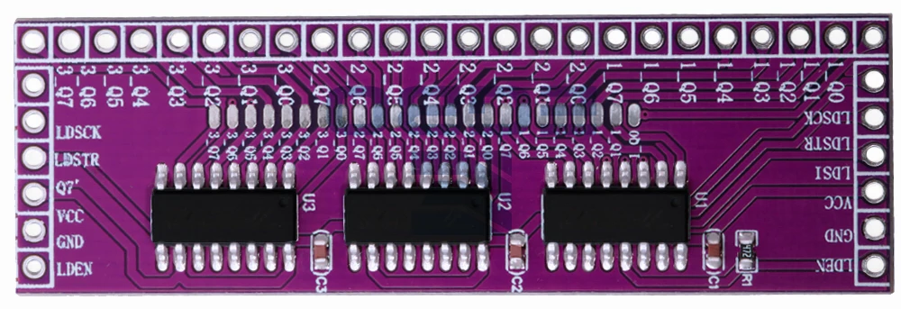

# Biblioteca MicroPython `hc595`

Biblioteca sencilla para controlar uno o varios registros de desplazamiento **74HC595 en cascada** desde MicroPython.

Está pensada para una **LOLIN S2 Mini (ESP32-S2)**, aunque puede utilizarse con otras placas MicroPython cambiando los GPIO.

---

## 1. Características

La biblioteca permite controlar:

- 1 o varios 74HC595 conectados en cascada.
- 8 salidas por cada 74HC595.
- Control individual de cada salida.
- Encendido/apagado de todas las salidas.
- Carga de las salidas mediante un valor entero.
- Consulta del estado lógico almacenado.
- Habilitación/deshabilitación de las salidas mediante `OE`.
- Test secuencial de todas las salidas.

La interfaz pública es:

```text
init()
enable()
disable()

full()
empty()

set(pin)
clear(pin)

get(pin)
getall()

setall(value)

test(delay)
```

---

# 2. Hardware

## 2.1. 74HC595

Cada 74HC595 proporciona **8 salidas digitales**.

Si se conectan varios en cascada:

| Chips | Salidas |
|---:|---:|
| 1 | 8 |
| 2 | 16 |
| 3 | 24 |
| 4 | 32 |

La biblioteca utiliza un único registro interno que contiene el estado de todas las salidas.

Para 3 chips:

```text
bit 23 ... bit 16 | bit 15 ... bit 8 | bit 7 ... bit 0
      chip 3              chip 2             chip 1
```

El orden físico exacto de Q0-Q7 entre los chips depende del cableado/cascada de la placa. La numeración de la biblioteca es la posición de bit que se utiliza al desplazar los datos. 

En el caso del módulo de la fotografia  la numeración de las salidas de los 3 chips coincide con el mostrado de izquierda a derecha: **bit23 ... bit0**, y la conexion con el microcontrolador se realiza por el conector derecho. Si en el conector izquierdo colocásemos otróm módulo igual sus salidas serian **bit47 ... bit24**




---

# 3. Conexión con LOLIN S2 Mini

Ejemplo utilizado en esta documentación:

| LOLIN S2 Mini | Módulo 74HC595 | Función |
|---|---|---|
| `3V3` | `VCC` | Alimentación |
| `GND` | `GND` | Tierra |
| `GPIO 11` | `LDSI` | Datos serie |
| `GPIO 12` | `LDSCK` | Reloj |
| `GPIO 13` | `LDSTR` | Latch |
| `GPIO 14` | `LEDEN` | OE / Output Enable |

```text
LOLIN S2 Mini              Módulo 74HC595
------------------------------------------
3V3       ---------------- VCC
GND       ---------------- GND

GPIO 11   ---------------- LDSI
GPIO 12   ---------------- LDSCK
GPIO 13   ---------------- LDSTR
GPIO 14   ---------------- LEDEN
```

Los GPIO son configurables mediante `init()` y los indicados son solamente el ejemplo utilizado.

---

# 4. OE / LEDEN

La entrada `OE` (*Output Enable*) del 74HC595 es **activa en LOW**:

```text
OE = 0  -> salidas habilitadas
OE = 1  -> salidas deshabilitadas
```

Por eso:

```python
hc595.enable()
```

pone `OE` a `0`, mientras que:

```python
hc595.disable()
```

pone `OE` a `1`.

`disable()` **no borra el registro interno**. Al volver a llamar a `enable()`, las salidas recuperan el estado que estaba almacenado.

---

# 5. Instalación

Copia el archivo:

```text
hc595.py
```

en el sistema de archivos de la placa MicroPython.

La estructura mínima puede ser:

```text
/
├── boot.py
├── main.py
└── hc595.py
```

En `main.py`:

```python
import hc595
```

---

# 6. Código completo de `hc595.py`

```python
from machine import Pin
import time


_num_chips = 0
_num_outputs = 0

_data = None
_clock = None
_latch = None
_oe = None

_register = 0


def init(num_chips, data_pin, clock_pin, latch_pin, oe_pin):
    """
    Inicializa los 74HC595.

    num_chips : número de chips conectados en cascada
    data_pin  : GPIO para LDSI
    clock_pin : GPIO para LDSCK
    latch_pin : GPIO para LDSTR
    oe_pin    : GPIO para LEDEN / OE
    """

    global _num_chips
    global _num_outputs
    global _data, _clock, _latch, _oe
    global _register

    _num_chips = num_chips
    _num_outputs = num_chips * 8

    _data = Pin(data_pin, Pin.OUT, value=0)
    _clock = Pin(clock_pin, Pin.OUT, value=0)
    _latch = Pin(latch_pin, Pin.OUT, value=0)

    # OE es activo en LOW.
    # Empezamos con las salidas deshabilitadas.
    _oe = Pin(oe_pin, Pin.OUT, value=1)

    # Registro interno a cero
    _register = 0

    # Enviar ceros a los 74HC595
    _write()

    # Habilitar las salidas
    enable()


def _write():
    """Envía el registro interno a los 74HC595."""

    _latch.value(0)

    for i in range(_num_outputs):
        bit = (_register >> (_num_outputs - 1 - i)) & 1

        _data.value(bit)

        _clock.value(1)
        _clock.value(0)

    # Transferir el registro de desplazamiento
    # al registro de salida.
    _latch.value(1)
    _latch.value(0)


def enable():
    """Habilita las salidas (OE = 0)."""

    _oe.value(0)


def disable():
    """Deshabilita las salidas (OE = 1)."""

    _oe.value(1)


def full():
    """Enciende todas las salidas."""

    global _register

    _register = (1 << _num_outputs) - 1
    _write()


def empty():
    """Apaga todas las salidas."""

    global _register

    _register = 0
    _write()


def set(pin):
    """
    Enciende una salida sin modificar las demás.

    pin = 0 ... (num_chips * 8 - 1)
    """

    global _register

    if pin < 0 or pin >= _num_outputs:
        return False

    _register |= (1 << pin)
    _write()

    return True


def clear(pin):
    """
    Apaga una salida sin modificar las demás.

    pin = 0 ... (num_chips * 8 - 1)
    """

    global _register

    if pin < 0 or pin >= _num_outputs:
        return False

    _register &= ~(1 << pin)
    _write()

    return True


def get(pin):
    """
    Devuelve el estado de una salida.

    True  = encendida
    False = apagada
    """

    if pin < 0 or pin >= _num_outputs:
        return False

    return bool(_register & (1 << pin))


def getall():
    """
    Devuelve el registro completo como entero.
    """

    return _register


def setall(value):
    """
    Carga el registro completo y actualiza las salidas.

    Ejemplos:

        setall(0x00)       -> todo apagado
        setall(0xFF)       -> 8 salidas encendidas
        setall(0xFFFF)     -> 16 salidas encendidas
        setall(0xFFFFFF)   -> 24 salidas encendidas
    """

    global _register

    max_value = (1 << _num_outputs) - 1

    # Comprobar que el valor es válido
    if value < 0 or value > max_value:
        return False

    _register = value
    _write()

    return True


def test(delay=0.1):
    """
    Enciende las salidas una a una.
    """

    global _register

    empty()

    for pin in range(_num_outputs):
        _register = 1 << pin
        _write()
        time.sleep(delay)

    empty()
```

---

# 7. API

## 7.1. `init()`

```python
hc595.init(num_chips, data_pin, clock_pin, latch_pin, oe_pin)
```

Inicializa la biblioteca.

### Parámetros

| Parámetro | Descripción |
|---|---|
| `num_chips` | Número de 74HC595 conectados en cascada |
| `data_pin` | GPIO conectado a LDSI / DATA |
| `clock_pin` | GPIO conectado a LDSCK / CLOCK |
| `latch_pin` | GPIO conectado a LDSTR / LATCH |
| `oe_pin` | GPIO conectado a LEDEN / OE |

Ejemplo:

```python
hc595.init(3, 11, 12, 13, 14)
```

Con 3 chips se obtienen:

```text
3 × 8 = 24 salidas
```

Al inicializar:

1. Se configuran los GPIO.
2. El registro interno se pone a `0`.
3. Se envían ceros a los 74HC595.
4. Las salidas se inicializan apagadas.
5. Finalmente se habilitan las salidas mediante `OE = 0`.

---

# 8. `enable()`

```python
hc595.enable()
```

Habilita las salidas:

```text
OE = 0
```

No modifica el registro.

Ejemplo:

```python
hc595.set(3)
hc595.disable()

# Las salidas están deshabilitadas,
# pero el registro sigue conteniendo el bit 3.

hc595.enable()

# La salida 3 vuelve a estar activa.
```

---

# 9. `disable()`

```python
hc595.disable()
```

Deshabilita las salidas:

```text
OE = 1
```

No modifica el registro.

Es útil para hacer un "blanking" de las salidas sin perder su estado.

---

# 10. `full()`

```python
hc595.full()
```

Enciende todas las salidas.

Con 3 chips:

```text
11111111 11111111 11111111
```

Equivalente a:

```python
hc595.setall(0xFFFFFF)
```

---

# 11. `empty()`

```python
hc595.empty()
```

Apaga todas las salidas.

Con 3 chips:

```text
00000000 00000000 00000000
```

Equivalente a:

```python
hc595.setall(0)
```

---

# 12. `set(pin)`

```python
hc595.set(pin)
```

Enciende una salida sin modificar las demás.

Con 3 chips los valores válidos son:

```text
0 ... 23
```

Ejemplo:

```python
hc595.empty()

hc595.set(0)
hc595.set(5)
hc595.set(17)
```

El resultado es:

```text
pin 0  -> ON
pin 5  -> ON
pin 17 -> ON
```

La función devuelve:

```text
True  -> operación correcta
False -> pin fuera de rango
```

---

# 13. `clear(pin)`

```python
hc595.clear(pin)
```

Apaga una salida sin modificar las demás.

Ejemplo:

```python
hc595.set(0)
hc595.set(5)
hc595.set(17)

hc595.clear(5)
```

Resultado:

```text
pin 0  -> ON
pin 5  -> OFF
pin 17 -> ON
```

Devuelve:

```text
True  -> operación correcta
False -> pin fuera de rango
```

---

# 14. `get(pin)`

```python
hc595.get(pin)
```

Devuelve el estado almacenado de una salida.

Resultado:

```text
True  -> salida encendida
False -> salida apagada
```

Ejemplo:

```python
hc595.set(5)

if hc595.get(5):
    print("Pin 5 encendido")
```

También se puede utilizar directamente:

```python
print(hc595.get(5))
```

---

# 15. `getall()`

```python
hc595.getall()
```

Devuelve el registro completo como un entero.

Con 3 chips el rango es:

```text
0x000000 ... 0xFFFFFF
```

Ejemplo:

```python
hc595.set(0)
hc595.set(4)
hc595.set(8)

valor = hc595.getall()

print(valor)
print(hex(valor))
```

Esto permite guardar fácilmente el estado:

```python
estado = hc595.getall()
```

y posteriormente restaurarlo con:

```python
hc595.setall(estado)
```

---

# 16. `setall(value)`

```python
hc595.setall(value)
```

Carga todo el registro de una sola vez.

Con 3 chips se utilizan 24 bits:

```text
23                    0
+---------------------+
|      24 bits        |
+---------------------+
```

Ejemplos:

```python
hc595.setall(0x000000)
```

Todas apagadas.

```python
hc595.setall(0xFFFFFF)
```

Todas encendidas.

```python
hc595.setall(0x0000FF)
```

Activa los 8 bits inferiores.

```python
hc595.setall(0xFF0000)
```

Activa los 8 bits superiores.

La función devuelve:

```text
True  -> valor válido
False -> valor fuera de rango
```

Con 3 chips:

```python
hc595.setall(0xFFFFFF)   # válido
```

pero:

```python
hc595.setall(0x1000000)  # inválido
```

porque ese valor necesita 25 bits.

---

# 17. `test(delay=0.1)`

```python
hc595.test()
```

Realiza una prueba secuencial de todas las salidas.

Por defecto utiliza:

```text
100 ms
```

entre salidas.

Ejemplo:

```text
Q0  ON
    OFF
Q1  ON
    OFF
Q2  ON
    OFF
...
Q23 ON
    OFF
```

También se puede especificar el tiempo:

```python
hc595.test(0.5)
```

usa 500 ms.

Para una prueba rápida:

```python
hc595.test(0.05)
```

usa 50 ms.

Al terminar, todas las salidas quedan apagadas.

---

# 18. Ejemplo básico

```python
import hc595
import time

hc595.init(3, 11, 12, 13, 14)

hc595.empty()

hc595.set(0)
hc595.set(5)
hc595.set(12)

time.sleep(2)

hc595.clear(5)

time.sleep(2)

hc595.full()

time.sleep(2)

hc595.empty()
```

---

# 19. Ejemplo utilizando `get()` y `getall()`

```python
import hc595

hc595.init(3, 11, 12, 13, 14)

hc595.empty()

hc595.set(0)
hc595.set(7)
hc595.set(15)

print("Pin 0:", hc595.get(0))
print("Pin 1:", hc595.get(1))
print("Pin 7:", hc595.get(7))
print("Pin 15:", hc595.get(15))

registro = hc595.getall()

print("Registro decimal:", registro)
print("Registro hexadecimal:", hex(registro))
print("Registro binario:", bin(registro))
```

---

# 20. Guardar y restaurar el estado

Una de las ventajas de `getall()` y `setall()` es poder guardar todo el estado en una sola variable.

```python
import hc595
import time

hc595.init(3, 11, 12, 13, 14)

hc595.set(0)
hc595.set(5)
hc595.set(10)
hc595.set(20)

estado = hc595.getall()

print("Estado guardado:", hex(estado))

hc595.empty()

time.sleep(2)

hc595.setall(estado)

print("Estado restaurado:", hex(hc595.getall()))
```

---

# 21. Ejemplo de utilización de `enable()` y `disable()`

```python
import hc595
import time

hc595.init(3, 11, 12, 13, 14)

hc595.setall(0x123456)

time.sleep(2)

# Apagar las salidas sin borrar el registro
hc595.disable()

time.sleep(2)

# Volver a mostrar el registro almacenado
hc595.enable()

time.sleep(2)

hc595.empty()
```

La secuencia es:

```text
Registro = 0x123456
       |
       v
    ENABLE
       |
       v
  Salidas activas
       |
       v
    DISABLE
       |
       v
  Salidas apagadas
       |
       |  registro sigue siendo 0x123456
       v
    ENABLE
       |
       v
  Salidas = 0x123456
```

---

# 22. Ejemplo completo con 3 chips

Este programa utiliza todas las funciones de la biblioteca.

```python
import hc595
import time


# ============================================================
# CONFIGURACIÓN
# ============================================================

NUM_CHIPS = 3

DATA_PIN  = 11
CLOCK_PIN = 12
LATCH_PIN = 13
OE_PIN    = 14


# ============================================================
# INIT
# ============================================================

print("Inicializando 74HC595...")

hc595.init(
    NUM_CHIPS,
    DATA_PIN,
    CLOCK_PIN,
    LATCH_PIN,
    OE_PIN
)

print("Chips:", NUM_CHIPS)
print("Salidas:", NUM_CHIPS * 8)


# ============================================================
# EMPTY
# ============================================================

print("EMPTY")

hc595.empty()

print("Registro:", hex(hc595.getall()))

time.sleep(1)


# ============================================================
# SET
# ============================================================

print("SET")

hc595.set(0)
hc595.set(5)
hc595.set(10)
hc595.set(15)
hc595.set(20)

print("Registro:", hex(hc595.getall()))

time.sleep(1)


# ============================================================
# GET
# ============================================================

print("GET")

for pin in range(24):
    print("Pin", pin, "=", hc595.get(pin))

time.sleep(1)


# ============================================================
# CLEAR
# ============================================================

print("CLEAR")

hc595.clear(5)
hc595.clear(15)

print("Registro:", hex(hc595.getall()))

time.sleep(1)


# ============================================================
# GETALL
# ============================================================

print("GETALL")

registro = hc595.getall()

print("Decimal:", registro)
print("Hexadecimal:", hex(registro))
print("Binario:", bin(registro))

time.sleep(1)


# ============================================================
# SETALL
# ============================================================

print("SETALL")

valor = (
    (1 << 0)  |
    (1 << 4)  |
    (1 << 8)  |
    (1 << 12) |
    (1 << 16) |
    (1 << 20)
)

hc595.setall(valor)

print("Valor enviado:", hex(valor))
print("Valor leído:", hex(hc595.getall()))

time.sleep(1)


# ============================================================
# DISABLE
# ============================================================

print("DISABLE")

print("Registro antes:", hex(hc595.getall()))

hc595.disable()

print("Salidas deshabilitadas")

time.sleep(2)


# ============================================================
# ENABLE
# ============================================================

print("ENABLE")

hc595.enable()

print("Salidas habilitadas")
print("Registro:", hex(hc595.getall()))

time.sleep(2)


# ============================================================
# FULL
# ============================================================

print("FULL")

hc595.full()

print("Registro:", hex(hc595.getall()))

time.sleep(2)


# ============================================================
# EMPTY
# ============================================================

print("EMPTY")

hc595.empty()

print("Registro:", hex(hc595.getall()))

time.sleep(2)


# ============================================================
# TEST
# ============================================================

print("TEST")

hc595.test(0.2)

print("Test terminado")


# ============================================================
# FIN
# ============================================================

hc595.empty()

print("Ejemplo terminado")
```

---

# 23. Ejemplo práctico: guardar/restaurar un patrón

```python
import hc595
import time

hc595.init(3, 11, 12, 13, 14)

# Crear patrón
hc595.empty()

hc595.set(0)
hc595.set(3)
hc595.set(8)
hc595.set(12)
hc595.set(19)
hc595.set(23)

# Guardar patrón
patron = hc595.getall()

print("Patrón:", hex(patron))

time.sleep(2)

# Apagar
hc595.empty()

time.sleep(2)

# Restaurar
hc595.setall(patron)

time.sleep(2)

hc595.empty()
```

---

# 24. Estado interno

La biblioteca mantiene una variable:

```python
_register
```

que representa el estado que se ha enviado a los 74HC595.

Por ejemplo:

```python
hc595.set(3)
```

hace conceptualmente:

```text
antes:

00000000 00000000 00000000

después:

00000000 00000000 00001000
```

Si posteriormente hacemos:

```python
hc595.set(10)
```

el resultado será:

```text
00000000 00000100 00001000
```

La función `set()` utiliza una operación OR para conservar los demás bits.

`clear()` utiliza una máscara para borrar únicamente el bit solicitado.

---

# 25. Importante sobre `get()` y `getall()`

El 74HC595 es principalmente un dispositivo de **salida**. La biblioteca no puede leer directamente el nivel eléctrico de sus salidas Q0-Q7.

Por tanto:

```python
hc595.get(pin)
```

y:

```python
hc595.getall()
```

consultan el **registro interno mantenido por la biblioteca**.

No son una lectura física de los pines de salida del 74HC595.

Por ejemplo:

```python
hc595.set(5)

print(hc595.get(5))
```

devuelve `True` porque la biblioteca sabe que el bit 5 está a `1`.

Si existe un problema eléctrico en el circuito externo, `get(5)` no puede detectarlo.

---

# 26. Resumen de la API

| Función | Descripción |
|---|---|
| `init(...)` | Inicializa la biblioteca y pone las salidas a cero |
| `enable()` | `OE = 0`, habilita las salidas |
| `disable()` | `OE = 1`, deshabilita las salidas |
| `full()` | Enciende todas las salidas |
| `empty()` | Apaga todas las salidas |
| `set(pin)` | Enciende una salida |
| `clear(pin)` | Apaga una salida |
| `get(pin)` | Consulta el estado almacenado de una salida |
| `getall()` | Devuelve todo el registro como entero |
| `setall(value)` | Carga todo el registro |
| `test(delay)` | Prueba secuencialmente todas las salidas |

---

# 27. Ejemplo mínimo

Para un proyecto real, normalmente bastará con:

```python
import hc595

hc595.init(3, 11, 12, 13, 14)

hc595.empty()

hc595.set(0)
hc595.set(7)
hc595.set(15)

if hc595.get(7):
    print("Salida 7 activa")

print("Registro:", hex(hc595.getall()))
```


