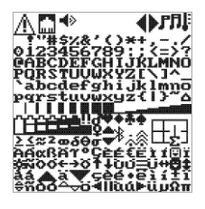
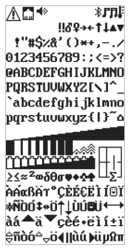

Librería MicroPython para pantallas OLED SSD1306 con I2C/SPI, framebuffer `framebuf` y soporte para fuentes bitmap personalizadas.

[▶️ Ver vídeo de demostración](./img/demo.mp4)

---

## 1. Descripción

`ssd1306_fonts.py` parte del driver SSD1306 de Adafruit para MicroPython y mantiene su estructura de bajo nivel para las interfaces I2C y SPI.

La librería utiliza un `framebuf.FrameBuffer1` como framebuffer de la pantalla. Esto permite utilizar directamente las primitivas gráficas de `framebuf` y, además, añadir un sistema de fuentes bitmap de tamaño configurable.

En la versión actual:

- `text()` se conserva para compatibilidad con la API original basada en `framebuf`.
- `draw_text()` utiliza exclusivamente la fuente bitmap indicada.
- Las fuentes bitmap pueden ser, por ejemplo, de **8×8** o **8×16**.
- La posición y el avance horizontal de los caracteres se determinan mediante `font.WIDTH`.
- La altura utilizada para cada carácter se determina mediante `font.HEIGHT`.
- `charset()` permite visualizar automáticamente toda una fuente.
- Las operaciones gráficas de `framebuf` se exponen directamente desde el objeto OLED.

---

## 2. Dependencias

La librería utiliza:

```python
import time
import framebuf
```

Para la conversión de coordenadas de `poly()` se utiliza además:

```python
from array import array
```

El módulo `framebuf` forma parte de MicroPython y proporciona el framebuffer y sus primitivas gráficas.

---

# 3. Estructura de una fuente bitmap

Las fuentes utilizadas por `draw_text()` deben proporcionar:

```python
WIDTH
HEIGHT
FIRST
LAST
_FONT
```

Por ejemplo, una fuente 8×16:

```python
WIDTH = 8
HEIGHT = 16
FIRST = 0
LAST = 255

_FONT = ...
```

Cada carácter ocupa:

```text
HEIGHT bytes
```

y cada byte representa una fila de:

```text
WIDTH píxeles
```

Para una fuente 8×16:

```text
8 píxeles de ancho
16 filas
16 bytes por carácter
```

El bit más significativo representa el píxel situado más a la izquierda.

---

## 4. Correspondencia de caracteres

`draw_text()` obtiene el código Unicode de cada carácter mediante:

```python
glyph = ord(ch)
```

El glifo se obtiene directamente mediante:

```python
index = glyph * font.HEIGHT
```

Por tanto, la organización de `_FONT` debe corresponder al código que se utiliza como índice.

Por ejemplo, si:

```python
FIRST = 0
LAST = 255
```

entonces el glifo correspondiente al código `65` ocupa:

```text
_FONT[65 * HEIGHT]
```

en adelante.

En las fuentes extendidas desarrolladas para esta librería es posible utilizar directamente cadenas Unicode, por ejemplo:

```python
oled.draw_text("AÁEÉIÍOÓUÚnñNÑ", 0, 0, font)
```

---

# 5. Crear la pantalla

## I2C

Ejemplo para un ESP32-S2 Mini:

```python
from machine import Pin, I2C
from ssd1306_fonts import SSD1306_I2C

i2c = I2C(
    0,
    scl=Pin(35),
    sda=Pin(33),
    freq=400000
)

oled = SSD1306_I2C(128, 64, i2c, 0x3C)
```

La clase I2C crea un framebuffer:

```python
framebuf.FrameBuffer1(...)
```

con el tamaño de la pantalla.

Para un OLED de 128×64:

```text
128 × 64 píxeles
1024 bytes de framebuffer
```

---

# 6. Métodos básicos

## `fill(col)`

Rellena todo el framebuffer.

```python
oled.fill(0)
```

Apaga todos los píxeles.

```python
oled.fill(1)
```

Enciende todos los píxeles.

---

## `pixel(x, y, col)`

Modifica un píxel individual.

```python
oled.pixel(10, 20, 1)
```

Apaga un píxel:

```python
oled.pixel(10, 20, 0)
```

---

## `show()`

Envía el contenido actual del framebuffer al OLED.

Las operaciones sobre `framebuf` modifican la memoria local; para visualizar el resultado hay que llamar a:

```python
oled.show()
```

---

## `scroll(dx, dy)`

Desplaza el contenido del framebuffer.

```python
oled.scroll(-1, 0)
```

Desplaza un píxel a la izquierda.

```python
oled.scroll(1, 0)
```

Desplaza un píxel a la derecha.

```python
oled.scroll(0, -1)
```

Desplaza hacia arriba.

```python
oled.scroll(0, 1)
```

Desplaza hacia abajo.

### Ejemplo

```python
import time

oled.fill(0)
oled.draw_text("HOLA MUNDO", 0, 24, font)
oled.show()

for _ in range(128):
    oled.scroll(-1, 0)
    oled.show()
    time.sleep_ms(20)
```

`scroll()` no actualiza físicamente la pantalla por sí mismo. Es necesario utilizar `show()`.

---

# 7. Texto

## `text(string, x, y, col=1)`

Es el método original basado en `framebuf`.

```python
oled.text("Hola", 0, 0, 1)
```

Se mantiene en la librería por compatibilidad.

La implementación delega directamente en:

```python
self.framebuf.text(...)
```

---

## `draw_text(text, x, y, font)`

Es el método principal para trabajar con las fuentes bitmap personalizadas.

Ejemplo:

```python
oled.draw_text("HOLA", 0, 0, font)
```

Con caracteres extendidos:

```python
oled.draw_text("AÁEÉIÍOÓUÚnñNÑ", 0, 0, font)
```

### Funcionamiento

Para cada carácter:

1. Obtiene el código con `ord()`.
2. Comprueba que no supere `font.LAST`.
3. Busca el glifo en `_FONT`.
4. Lo dibuja mediante `_draw_glyph()`.
5. Avanza horizontalmente `font.WIDTH`.

El avance horizontal es:

```python
cx += font.WIDTH
```

Por tanto, una fuente de 8 píxeles de ancho avanza 8 píxeles por carácter.

### Salto de línea

La implementación actual no utiliza un tratamiento especial de `\n`. Para distribuir texto en varias líneas se recomienda llamar a `draw_text()` por separado:

```python
oled.draw_text("LINEA 1", 0, 0, font)
oled.draw_text("LINEA 2", 0, font.HEIGHT, font)
```

---

# 8. `_draw_glyph()`

Método interno utilizado por `draw_text()`.

```python
oled._draw_glyph(glyph, x, y, font)
```

Cada carácter ocupa:

```python
font.HEIGHT
```

bytes.

Cada byte contiene una fila del carácter.

El método recorre:

```python
for row in range(font.HEIGHT):
```

y:

```python
for col in range(font.WIDTH):
```

activando los píxeles cuyo bit correspondiente está a 1.

No está pensado como API de uso habitual; normalmente debe utilizarse:

```python
oled.draw_text(...)
```

---

# 9. `charset(font, pausa)`

Muestra todos los caracteres disponibles de una fuente, repartidos automáticamente en tantas pantallas como sean necesarias.

```python
oled.charset(font, 2)
```

El segundo parámetro es el tiempo de espera entre pantallas, en segundos.

La función calcula automáticamente:

```text
columnas = ancho OLED / ancho de fuente
filas    = alto OLED / alto de fuente
```

y por tanto no está limitada a una fuente concreta.

## OLED 128×64 + fuente 8×16

Se obtiene:

```text
128 / 8  = 16 caracteres por fila
64 / 16 = 4 filas
```

Es decir:

```text
16 × 4 = 64 caracteres por pantalla
```

Una fuente de 256 caracteres necesita cuatro pantallas.

## OLED 128×64 + fuente 8×8

Se obtiene:

```text
128 / 8 = 16 columnas
64 / 8  = 8 filas
```

Por tanto:

```text
16 × 8 = 128 caracteres por pantalla
```

Una fuente de 128 caracteres cabe completa en una sola pantalla.

### Ejemplo

```python
oled.charset(font, 2)
```

La función utiliza `draw_text()` para representar cada carácter, por lo que la prueba se realiza mediante exactamente el mismo mecanismo de renderizado utilizado por el texto normal de la aplicación.

---

# 10. Primitivas gráficas de `framebuf`

La librería expone directamente varias funciones de `FrameBuffer`.

Estas funciones modifican el framebuffer. Para ver el resultado:

```python
oled.show()
```

---

## `line(x1, y1, x2, y2, col=1)`

Dibuja una línea.

```python
oled.line(0, 0, 127, 63)
```

Ejemplo:

```python
oled.fill(0)

oled.line(0, 0, 127, 63, 1)
oled.line(127, 0, 0, 63, 1)

oled.show()
```

---

## `hline(x, y, w, col=1)`

Línea horizontal.

```python
oled.hline(0, 32, 128, 1)
```

---

## `vline(x, y, h, col=1)`

Línea vertical.

```python
oled.vline(64, 0, 64, 1)
```

---

## `rect(x, y, w, h, col=1, f=False)`

Dibuja un rectángulo.

```python
oled.rect(10, 10, 50, 30, 1)
```

Rectángulo relleno:

```python
oled.rect(10, 10, 50, 30, 1, True)
```

---

## `fill_rect(x, y, w, h, col=1)`

Dibuja directamente un rectángulo relleno.

```python
oled.fill_rect(20, 20, 40, 15, 1)
```

---

## `ellipse(x, y, rx, ry, col=1, f=False)`

Dibuja una elipse.

```python
oled.ellipse(64, 32, 30, 20)
```

El último parámetro permite rellenarla:

```python
oled.ellipse(64, 32, 30, 20, 1, True)
```

---

# 11. `poly()`

Dibuja un polígono utilizando las coordenadas relativas de `FrameBuffer.poly()`.

La función de la librería acepta una secuencia normal de Python y la convierte a un `array('h')` para satisfacer el requisito de buffer de `FrameBuffer.poly()`.

Ejemplo:

```python
oled.poly(
    64,
    32,
    (0, -20, 20, 20, -20, 20),
    1,
    True
)
```

Esto permite utilizar coordenadas negativas sin tener que construir manualmente el `array`.

La forma general es:

```python
oled.poly(x, y, coords, col=1, f=False)
```

donde `coords` contiene pares de coordenadas:

```text
x1, y1, x2, y2, x3, y3, ...
```

---

# 12. `blit()`

Permite copiar un framebuffer dentro del framebuffer del OLED.

```python
oled.blit(fbuf, x, y, key=-1, palette=None)
```

Por ejemplo, podemos crear un framebuffer de 32×16:

```python
import framebuf

buf = bytearray(32 * 16 // 8)
sprite = framebuf.FrameBuffer1(buf, 32, 16)

sprite.fill(0)
sprite.rect(0, 0, 31, 15, 1)
sprite.line(0, 0, 31, 15, 1)
sprite.line(31, 0, 0, 15, 1)

oled.fill(0)
oled.blit(sprite, 10, 20)
oled.show()
```

## Uso de `key`

El parámetro `key` permite utilizar un color como transparente.

Ejemplo:

```python
oled.blit(sprite, 40, 20, 0)
```

En este caso los píxeles de valor `0` del sprite actúan como transparencia al copiarlo.

---

# 13. Sprites sobre un fondo

`blit()` copia los píxeles del framebuffer origen sobre el framebuffer destino.

Por ello, mover un sprite no significa automáticamente que se restaure el fondo que había debajo.

Si se hace:

```python
oled.blit(sprite, 10, 30, 0)
oled.blit(sprite, 20, 30, 0)
```

el fondo de la primera posición puede permanecer afectado.

Una estrategia sencilla es mantener un framebuffer independiente que contenga el fondo y restaurarlo antes de dibujar cada posición del sprite.

Ejemplo conceptual:

```python
fondo_buf = bytearray(128 * 64 // 8)
fondo = framebuf.FrameBuffer1(fondo_buf, 128, 64)

fondo.fill(0)
fondo.text("FONDO", 0, 0, 1)
fondo.rect(10, 20, 108, 35, 1)

for x in range(10, 110, 2):

    oled.framebuf.blit(fondo, 0, 0)
    oled.blit(sprite, x, 30, 0)

    oled.show()
```

Esta solución es sencilla, aunque copia el framebuffer completo en cada iteración.

Para animaciones más exigentes puede ser preferible conservar solamente la región del fondo que queda debajo del sprite y restaurar únicamente esa región.

---

# 14. Ejemplo gráfico completo

El siguiente ejemplo combina texto bitmap y primitivas gráficas:

```python
oled.fill(0)

oled.rect(0, 0, 127, 63, 1)
oled.hline(0, 18, 128, 1)

oled.draw_text("OLED 128x64", 20, 2, font)

oled.ellipse(64, 41, 25, 14, 1)
oled.line(10, 55, 118, 25, 1)

oled.show()
```

---

# 15. Ejemplo con fuente 8×16

```python
import vga1_8x16 as font

oled.fill(0)

oled.draw_text("ABCDEFGHIJKLMNOPQRSTUVWXYZ", 0, 0, font)
oled.draw_text("abcdefghijklmnopqrstuvwxyz", 0, 16, font)
oled.draw_text("0123456789", 0, 32, font)

oled.show()
```

---

# 16. Ejemplo con fuente extendida

Si la fuente contiene directamente los caracteres Unicode que se desean representar:

```python
import vga2_fonts_8x16 as font

oled.fill(0)

oled.draw_text(
    "AÁEÉIÍOÓUÚnñNÑ",
    0,
    0,
    font
)

oled.show()
```

La fuente puede contener tanto caracteres ASCII como caracteres extendidos, siempre que los códigos estén incluidos en el rango definido por `FIRST` y `LAST`.

---

# 17. Ejemplo de prueba de una fuente completa

Para comprobar una fuente:

```python
oled.charset(font, 2)
```

Esto permite comprobar rápidamente:

- todos los glifos;
- el tamaño de cada carácter;
- el espaciado horizontal;
- la posición vertical;
- los caracteres extendidos;
- el comportamiento de la fuente con distintas resoluciones de OLED.

---

# 18. Contraste e inversión

## `contrast(contrast)`

Modifica el contraste:

```python
oled.contrast(128)
```

El valor depende del controlador y del rango admitido por el SSD1306.

## `invert(invert)`

Invierte o restaura la visualización:

```python
oled.invert(1)
```

Normal:

```python
oled.invert(0)
```

---

# 19. Alimentación de la pantalla

## `poweroff()`

Apaga la pantalla:

```python
oled.poweroff()
```

La memoria del framebuffer se conserva, de modo que el contenido puede volver a mostrarse cuando corresponda mediante las operaciones de inicialización/encendido utilizadas por la implementación.

---

# 20. SPI

La librería conserva también una implementación `SSD1306_SPI`.

Ejemplo de creación:

```python
oled = SSD1306_SPI(
    width,
    height,
    spi,
    dc,
    res,
    cs
)
```

La implementación utiliza un `FrameBuffer1` igual que la variante I2C, por lo que las operaciones de dibujo y fuentes son conceptualmente las mismas.

---

# 21. Flujo de trabajo recomendado

Una aplicación típica puede organizarse así:

```python
from machine import Pin, I2C
from ssd1306_fonts import SSD1306_I2C
import vga1_8x16 as font

i2c = I2C(
    0,
    scl=Pin(35),
    sda=Pin(33),
    freq=400000
)

oled = SSD1306_I2C(128, 64, i2c, 0x3C)

oled.fill(0)

oled.draw_text("Hola mundo", 0, 0, font)
oled.rect(0, 18, 127, 45, 1)
oled.hline(0, 35, 128, 1)
oled.ellipse(96, 48, 15, 10, 1)

oled.show()
```

---

# 22. Filosofía de la librería

La librería mantiene deliberadamente una estructura sencilla:

```text
SSD1306
   │
   └── FrameBuffer1
          │
          ├── fill
          ├── pixel
          ├── scroll
          ├── line
          ├── hline
          ├── vline
          ├── rect
          ├── fill_rect
          ├── ellipse
          ├── poly
          └── blit

SSD1306.draw_text()
   │
   └── fuente bitmap externa
          ├── WIDTH
          ├── HEIGHT
          ├── FIRST
          ├── LAST
          └── _FONT
```

La idea es utilizar `framebuf` para las operaciones gráficas y una representación bitmap externa para el texto, sin sustituir ni modificar innecesariamente las capacidades originales del driver.

---

# 23. Resumen de la API

| Método | Función |
|---|---|
| `fill(col)` | Rellena el framebuffer |
| `pixel(x, y, col)` | Modifica un píxel |
| `show()` | Envía el framebuffer al OLED |
| `scroll(dx, dy)` | Desplaza el contenido |
| `text(string, x, y, col)` | Texto original de `framebuf` |
| `draw_text(text, x, y, font)` | Texto con fuente bitmap |
| `charset(font, pausa)` | Muestra toda una fuente por pantallas |
| `ellipse(x, y, rx, ry, col, f)` | Elipse |
| `line(x1, y1, x2, y2, col)` | Línea |
| `hline(x, y, w, col)` | Línea horizontal |
| `vline(x, y, h, col)` | Línea vertical |
| `fill_rect(x, y, w, h, col)` | Rectángulo relleno |
| `rect(x, y, w, h, col, f)` | Rectángulo |
| `poly(x, y, coords, col, f)` | Polígono |
| `blit(fbuf, x, y, key, palette)` | Copia otro framebuffer |
| `contrast(contrast)` | Ajusta contraste |
| `invert(invert)` | Invierte la pantalla |
| `poweroff()` | Apaga la pantalla |

---

## 24. Ejemplo mínimo

```python
from machine import Pin, I2C
from ssd1306_fonts import SSD1306_I2C
import vga1_8x16 as font

i2c = I2C(
    0,
    scl=Pin(35),
    sda=Pin(33),
    freq=400000
)

oled = SSD1306_I2C(128, 64, i2c, 0x3C)

oled.fill(0)
oled.draw_text("HOLA OLED", 0, 0, font)
oled.rect(0, 20, 127, 43, 1)
oled.show()
```

## 25. Fuentes personalizadas

Se incluyen fuentes 8x8 (vga2_fonts_8x8) y 8x16 (vga2_fonts_8x16) con los caracteres acentuados en su posición Unicode de forma que transcriben literalmente textos acentuados. También incluyen símbolos interesantes para desarrollo de proyectos en MicroPython (altavoz, Wi-Fi, red, peligro ...)

La fuente vga2_fonts_8x16 además lleva incorporada métodos para representar niveles de bateŕia, progreso de tareas y vúmetros, como se muestra en el ejemplo




También se incluye un editor de fuentes de caracteres. Sólo se deben introducir las definiciones de los
caracteres, sin la cabecera ni la declaración final del archivo.

